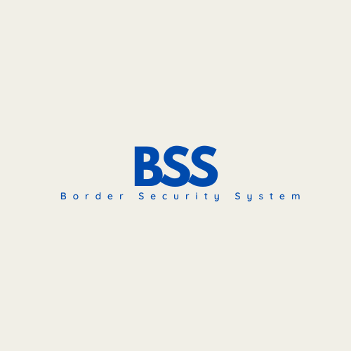

# Welcome to Border Security System (BSS) 🚀

<center>



</center>

The Border Security System (BSS) is an innovative project aimed at enhancing border security through modern technology. Discover our state-of-the-art solutions designed to provide advanced surveillance and security for critical areas.

## 🌟 Features

- **BSS (Border Security System)**: A smart IoT device designed for comprehensive security surveillance. Includes 360-degree cameras, advanced sensors, and solar-powered poles.
  
- **SSP (Smart Pole Based on the Principle of IoT)**: A versatile smart pole for various applications, featuring a 360-degree camera, solar power, and remote control via the BSS Companion app.

- **3D Designs**: View the detailed 3D designs of our systems to understand their structure and capabilities.

## 🚀 Getting Started

1. **Clone the Repository:**

    ```bash
    git clone https://github.com/gaureshpai/ArcanaTechnology.git
    cd ArcanaTechnology
    ```

2. **Install Dependencies:**

    ```bash
    npm install
    ```

3. **Run the Application:**

    ```bash
    npm run dev
    ```

    Open [http://localhost:3000](http://localhost:3000) in your browser to explore the Border Security System.

## 🎨 Usage

- **About**: Learn about the mission and vision of Arcana Technology and the BSS project, including key team members and acknowledgments.

- **BSS**: Understand the features, technology, and design of the Border Security System. Review the 3D design and application areas.

- **SSP**: Explore the Smart Pole technology, its applications, and the control app. View the 3D design for detailed insights.

## 🤝 Contributing

We welcome contributions from the community! If you have suggestions, improvements, or bug fixes, please open an issue or submit a pull request.

## 🔧 Technologies Used

- **Next.js**: Framework for building server-rendered React applications.
  
- **Tailwind CSS**: Utility-first CSS framework for modern and responsive design.

- **IoT Technology**: Advanced IoT devices and sensors for enhanced surveillance and security.

## 📄 License

Border Security System is licensed under the MIT License. See the [LICENSE](LICENSE) file for details.

## 🙌 Acknowledgments

The Border Security System project is made possible by the contributions of our team and the following technologies:

- React
- Next.js
- Tailwind CSS
- IoT Sensors and Devices

Thank you for your interest in enhancing border security with our cutting-edge solutions! 🎉
